# Дипломная работа
Для запуска развёртывания инфраструктуры необходимо:

  1. Вытянуть текущий репозиторий;
  2. Перейти в каталог sa_state, прсоздать файл `personal.auto.tfvars` и наполнить его соответствующими переменным(см. [пример](./sa_state/personal.auto.tfvars_example) );
  3. Выполнить команду `terraform apply`. Будут созданы: 
      - корзина для хранения будущего состояния проекта terrafrom;
      - в домашнем каталоге будет создан каталог .aws, в котором будет находится файл с данными для доступа к корзине;
      - в домашнем каталоге будет создан каталог .yc, в котором будет находиться файл с ключами использования сервисного аккаунта;
  4. В корне репозитория создать файл `personal.auto.tfvars` и наполнить его соответствующими переменным(см. [пример](personal.auto.tfvars_example) );
  5. Запустить проект коммандой `terraform apply`.

После чего в течении 35 минут будет выполняться cloud init, в следствии чего установтся:

1. kubespray, развернётся кластер kubernetes;
2. nginx-app, тестовое приложение;
3. kube-prometheus, grafana + prometheus;
4. atlantis, atlantis. Также автоматически добавится webhook для атлантиса;
5. gitlab, установка GitLab + автоматическая настройка webhoook и GitHub Actions.

Для CI/CD выбран gitlab, который поднимается на отдельной приватной машине. После каждого push-а в репозиторий приложения, автоматически запустится сборка и развёртывание. Для применения конфигурации terraform использован atlantis. После каждого pull request-а будет (если выбрали) применена конфигурация.

## Вопросы диплома:

### 1.

 - 1.1. [Файлы](./) terraform.
 - 1.2. [Репозиторий тестового приложения](https://github.com/StudentIrgups/nginx_index_file.git) nginx + pipeline для автоматической сборки приложения и развёртывания.
 - 1.3. [Репозиторий ansible atlantis](https://github.com/StudentIrgups/ansible-atlantis.git) .
 - 1.4. [Репозиторий ansible gitlab](https://github.com/StudentIrgups/ansible-gitlab.git) .

### 2.

    Тест atlantis:

    Для тестирования добавим подсеть в зоне "E".

    Подсети до добавления:

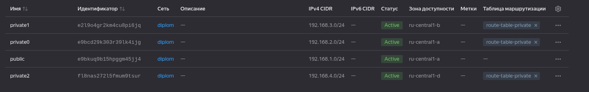

    Добавляем, делаем коммит в новую ветку:

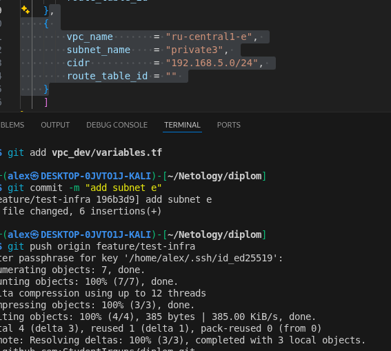    

    Смотрим pull request:

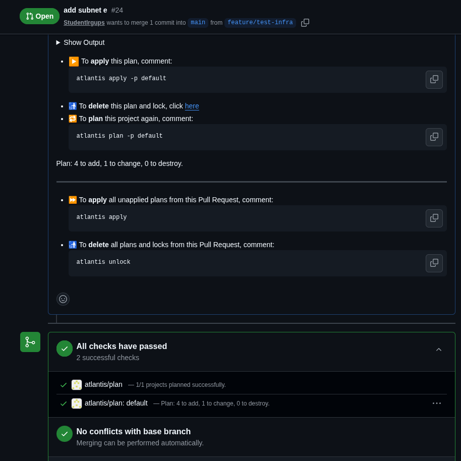    

    Смотрим `terraform plan` в atlantis (добавится подсеть, но так как за каждой подсетью закреплена приватная машина, то ресурс с тремя(а теперь 5-ю) машинами тоже обновится):

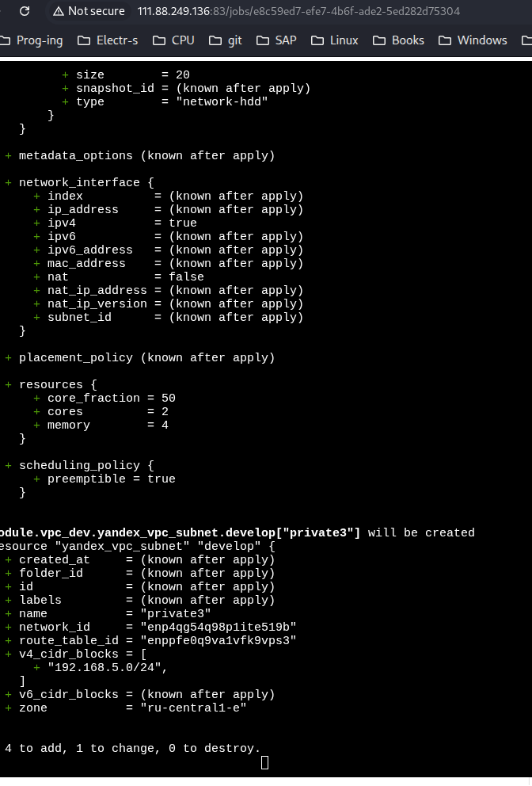    

    Добавляется подсеть, + 2 машины, чтобы количество машин было нечётным для etcd.

    Смотрим процесс применения изменений:

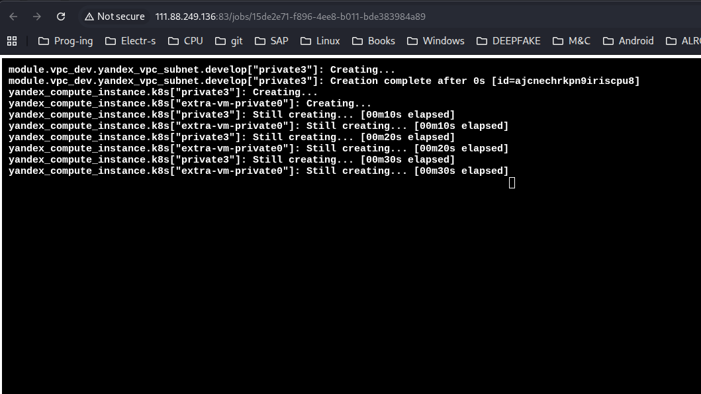 

    Результат:

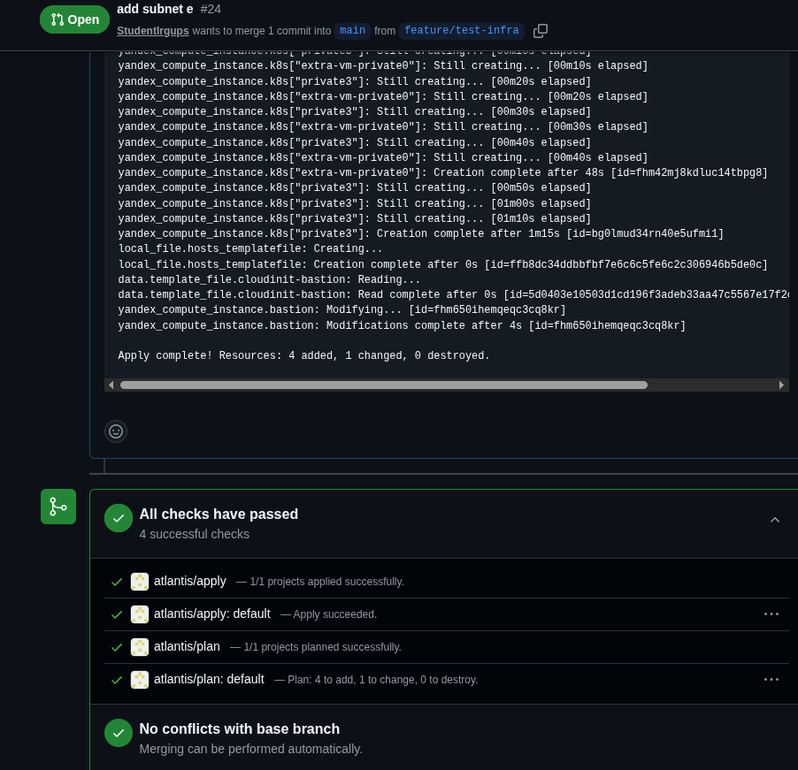

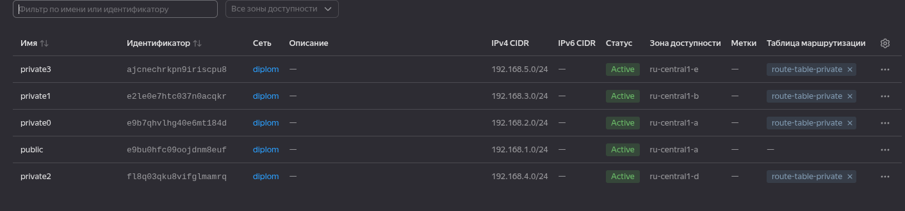

### 3.

    Тестируем автоматическую сборку и развёртывание приложения:

    Начальный вариант:

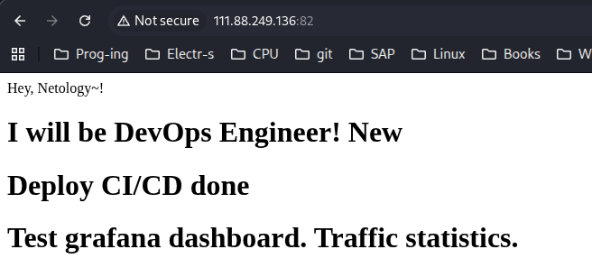

    Добавляем строку в приложение и фиксируем изменения:

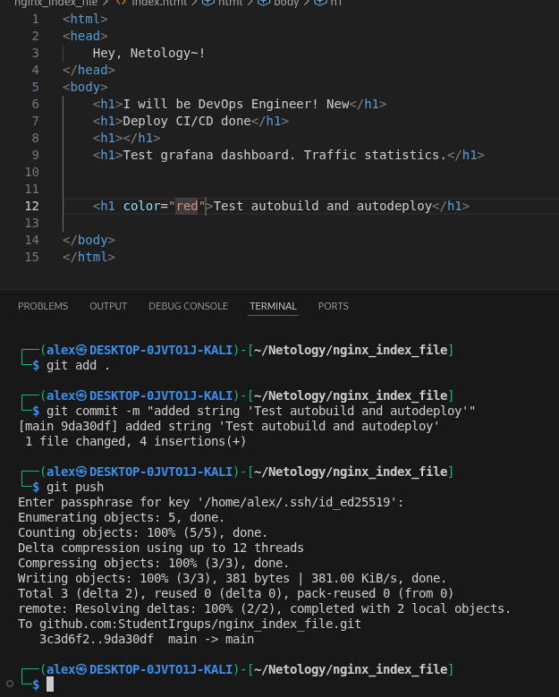

    Реакция GitHub:

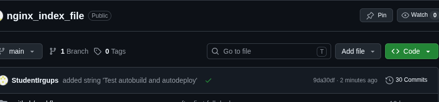    

    Build and Deploy:

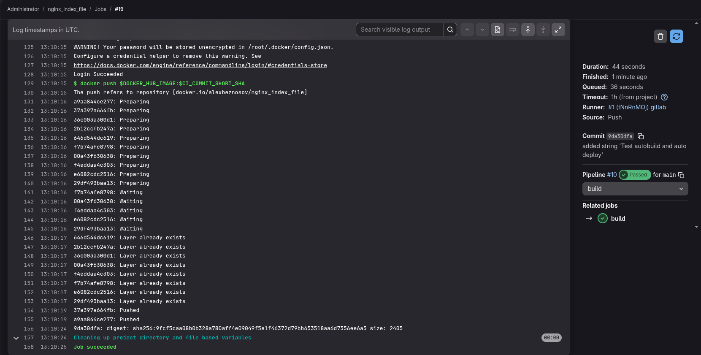

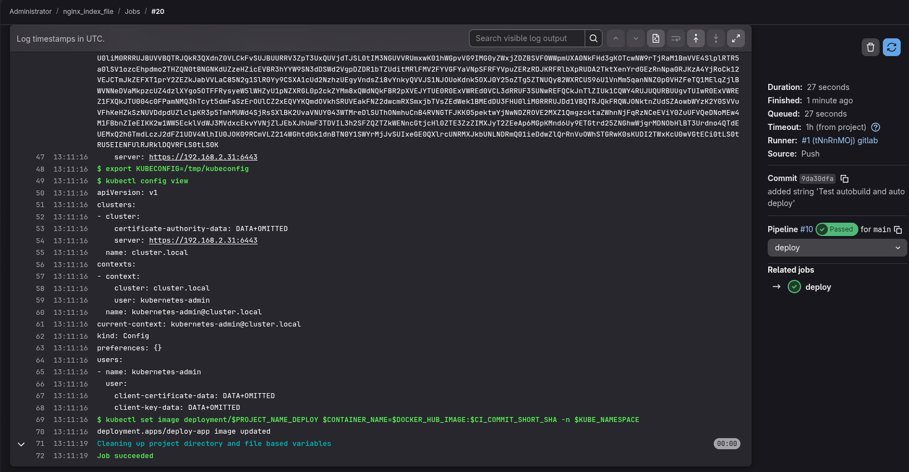

    Обновляем страницу и видим новое приложение:

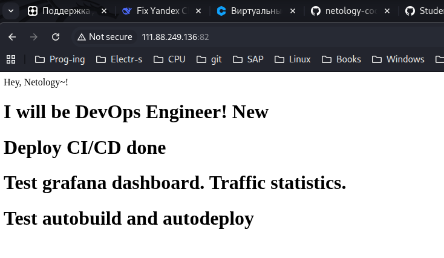    

[Ссылка](https://hub.docker.com/repository/docker/alexbeznosov/nginx_index_file/general) на автоматически собранный Docker образ приложения.

### 4.

[Репозиторий тестового приложения](https://github.com/StudentIrgups/nginx_index_file.git) nginx + pipeline для автоматической сборки приложения и развёртывания.

### 5. 

Kubernetes кластер поднят через kubespray.

### 6.

    Результаты работы Grafana:

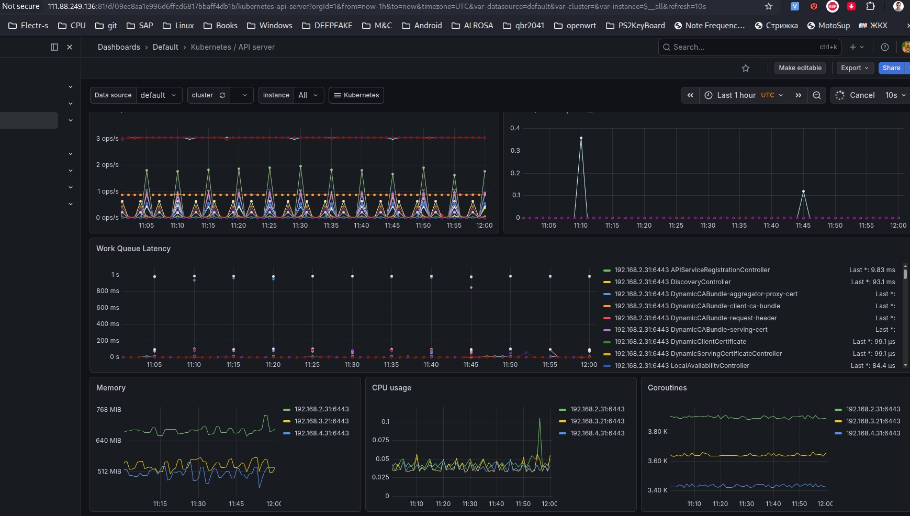

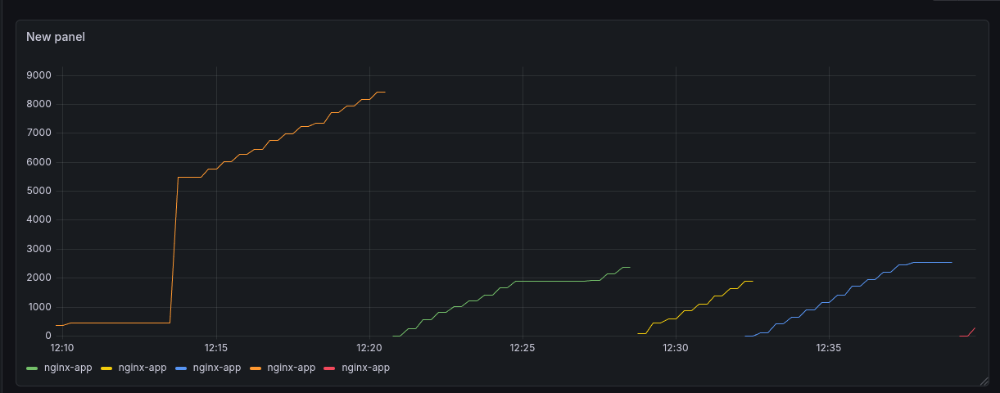

### 7.

    Webhooks and GitHubActions:

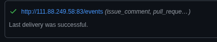    

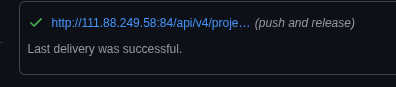

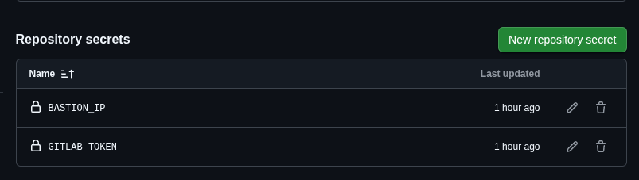